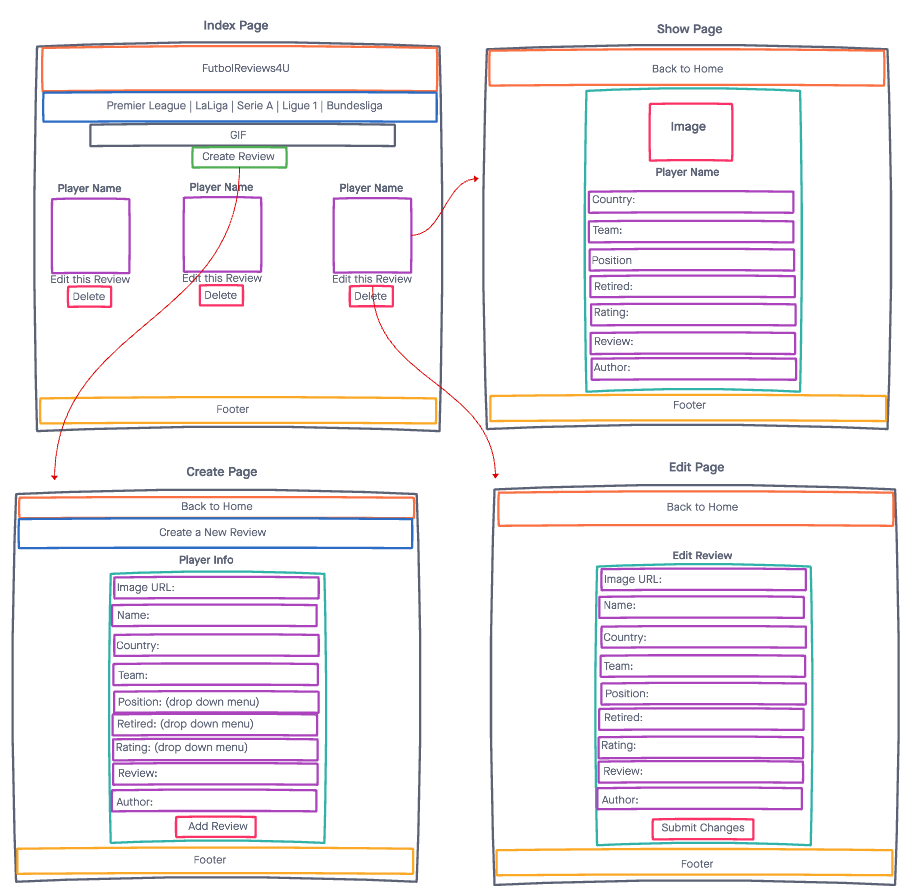

# **FutbolReviews4U**

 This app allows users to create, read, update, and delete reviews of professional soccer players. Users input an image of the player, name, nationality, the team the player plays on, position, a rating out of 5, their review, and their own name to show up next to the review. Users can also click on the top 5 soccer leagues in the world, and get redirected to their main site. Users are allowed to sign in and create their own account. 

## Technologies Used:
- HTML
- CSS
- JavaScript
- Express
- MongoDB
- Google Fonts
- Imgur

## Screenshots:
These screenshots show a quick sketch of what the app looks while the user navigates through it.

## Getting Started:
[Click here](https://pick-your-poison1.vercel.app/) to check the app out! NEED TO CHANGE LINK

## Future Enhacements:
- The ability to have a filter option to look for a specific player.